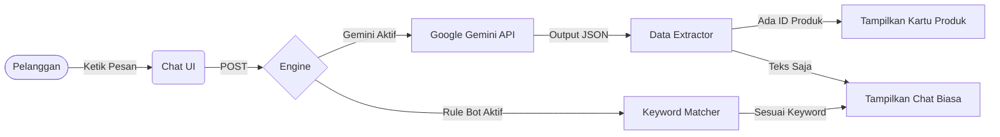

<div align="center">


# ⚡ HIGH FIVE ⚡
**Masa Depan Fashion Commerce Ada di Sini.**

[](https://laravel.com)
[](https://alpinejs.dev)
[](https://tailwindcss.com)
[](https://ai.google.dev/)

*Bukan sekadar pakaian. Ini tentang gaya hidup.*

</div>

---

> **HIGH FIVE** mendefinisikan ulang pengalaman belanja *online*. Kami membangun platform *e-commerce* bergaya modern yang terintegrasi secara mulus dengan asisten AI masa depan. Belanja *streetwear* bukan lagi sekadar transaksi; ini adalah sebuah pengalaman interaktif.

## 🔥 The Vibe (Fitur Utama)

### 🧠 Gemini-Powered Sales Assistant
Lupakan *chatbot* kaku yang membosankan. AI kami bertindak layaknya *fashion stylist* pribadimu langsung di dalam *website*.
- **Rekomendasi Visual Pintar:** Tanya apa yang sedang tren, dan bot ini tidak hanya menjawab dengan teks—tapi langsung menampilkan **Kartu Produk** interaktif di dalam *chat*.
- **Paham Konteks:** AI ini hafal luar dalam soal inventaris, harga, dan rilis terbaru kita. Tanya soal warna atau ukuran, dan dia akan mengecek *database* secara *real-time*.
- **Anti Spam:** Berkat instruksi khusus (*prompt-engineering* ketat), bot ini tidak akan melenceng dari topik *brand* kita. Ngomongin hal di luar pakaian? Bot akan diam.

### 🛍️ The Storefront (Etalase Belanja)
- **Katalog Eksklusif:** Halaman belanja yang sangat cepat, dinamis, dan memanjakan mata, dibangun dengan estetika Tailwind CSS.
- **Pengalaman Cart yang Mulus:** Mulai dari memilih varian (warna/ukuran) hingga *checkout*, setiap interaksi terasa sangat lancar (berkat Alpine.js).
- **Hype Drops:** Sistem hitung mundur (*countdown*) bawaan untuk peluncuran koleksi eksklusif atau *Flash Sale*.

### 🕶️ Control Room (Dashboard Admin)
- **Live Takeover:** Pantau obrolan pelanggan secara *real-time*. Kalau AI butuh bantuan, admin manusia bisa langsung mengambil alih obrolan kapan saja.
- **Satu Tombol Sakti:** Ganti mode operasional *website* sesuka hati—dari Gemini AI yang super cerdas, kembali ke *Rule-Based Bot* biasa, atau masuk ke mode Manual sepenuhnya. Semuanya cuma butuh satu klik.

---

## 🏗️ Under the Hood (Di Balik Layar)

### Arsitektur Sistem


### Struktur Database Utama
| Tabel Model | Fungsi & Peran |
| :--- | :--- |
| `User` | Mengatur profil pelanggan dan hak akses Admin. |
| `Product` | Katalog utama. Menyimpan nama koleksi, harga, deskripsi, dan status hype/diskon. |
| `ProductVariant` | Detail spesifik produk. Mengatur ketersediaan warna, ukuran, dan stok secara *real-time*. |
| `Message` | Menyimpan seluruh riwayat *Live Chat* lintas-*device* antara pelanggan, AI, dan Admin. |
| `Order` | Rekam jejak pembelian dan status *checkout* pelanggan. |

---

## 🚀 Cara Menjalankan (Instalasi)

Ingin menjalankan sistem ini di komputermu? Ikuti langkah mudah berikut:

**1. Clone Source Code**
```bash
git clone https://github.com/username/highfive.git
cd highfive/laravel
```

**2. Install Dependencies**
```bash
composer install
npm install && npm run build
```

**3. Konfigurasi Environment**
```bash
cp .env.example .env
php artisan key:generate
```
*Buka file `.env` dan masukkan kredensial database-mu, serta jangan lupa masukkan **API Key Google Gemini**.*

**4. Bangun Database**
```bash
php artisan migrate --seed
php artisan storage:link
```

**5. Launching**
```bash
php artisan serve
```
*Buka `http://localhost:8000` di browsermu dan nikmati pengalamannya.*

---

<div align="center">
  <p><strong>Stay hype. Stay stylish.</strong></p>
  <p>Dibuat dengan semangat penuh oleh <strong>Tim HIGH FIVE</strong>.</p>
</div>
