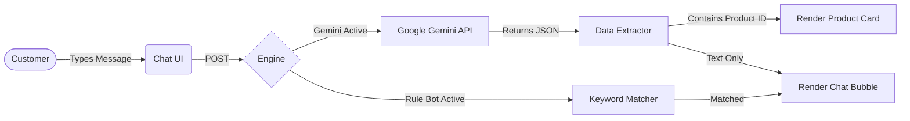

<div align="center">


# ⚡ HIGH FIVE ⚡
**The Future of Fashion Commerce is Here.**

[](https://laravel.com)
[](https://alpinejs.dev)
[](https://tailwindcss.com)
[](https://ai.google.dev/)

*More than just clothes. It's a statement.*

</div>

---

> **HIGH FIVE** redefines the online shopping experience. We built a cutting-edge, stylish e-commerce platform integrated seamlessly with a next-generation AI assistant. Shopping for streetwear shouldn't just be a transaction; it should be an experience.

## 🔥 The Vibe (Key Features)

### 🧠 Gemini-Powered Sales Assistant
Forget boring chatbots. Our AI acts like your personal fashion stylist right on the website.
- **Smart Visual Recommendations:** Ask the bot what's trending, and it won't just tell you—it'll show you. The AI drops slick **Product Cards** right in the chat.
- **Context-Aware:** It knows our inventory, prices, and release dates. Ask about sizes or colors, and it checks the database in real-time.
- **Zero Bullsh*t:** Strict AI prompt-engineering ensures the bot stays on brand. It ignores spam and focuses entirely on fashion.

### 🛍️ The Storefront
- **Sleek Catalog:** Fast, dynamic, and visually stunning storefront built with Tailwind CSS.
- **Flawless Cart Experience:** From adding to cart to checking out, every interaction is butter-smooth (powered by Alpine.js).
- **Hype Drops:** Built-in countdowns for exclusive flash sales and limited releases.

### 🕶️ Control Room (Admin Dashboard)
- **Live Takeover:** Watch customer chats in real-time. If the AI needs help, human admins can jump in instantly.
- **Toggle The Matrix:** Switch between our ultra-smart Gemini AI, a standard Rule-based Bot, or pure Manual Mode with a single click.

---

## 🏗️ Under the Hood

### System Architecture


### The Database Structure
| Core Models | What it handles |
| :--- | :--- |
| `User` | Customer profiles and Admin access levels. |
| `Product` | The threads. Names, prices, descriptions, and hype status. |
| `ProductVariant` | The specifics. Colors, sizes, and real-time stock levels. |
| `Message` | Unified cross-device chat histories linking customers to admins (and AI). |
| `Order` | Purchase history and checkout statuses. |

---

## 🚀 Get It Running

Want to spin up the local environment? Follow these steps:

**1. Clone the Source**
```bash
git clone https://github.com/yourusername/highfive.git
cd highfive/laravel
```

**2. Install the Dependencies**
```bash
composer install
npm install && npm run build
```

**3. Configure the Environment**
```bash
cp .env.example .env
php artisan key:generate
```
*Open `.env` and plug in your database credentials and your **Google Gemini API Key**.*

**4. Build the Database**
```bash
php artisan migrate --seed
php artisan storage:link
```

**5. Launch**
```bash
php artisan serve
```
*Drop into `http://localhost:8000` and experience it yourself.*

---

<div align="center">
  <p><strong>Stay hype. Stay stylish.</strong></p>
  <p>Built with passion by the <strong>HIGH FIVE Team</strong>.</p>
</div>
