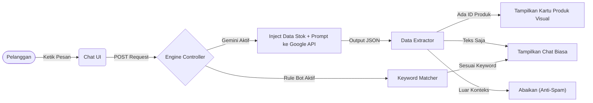
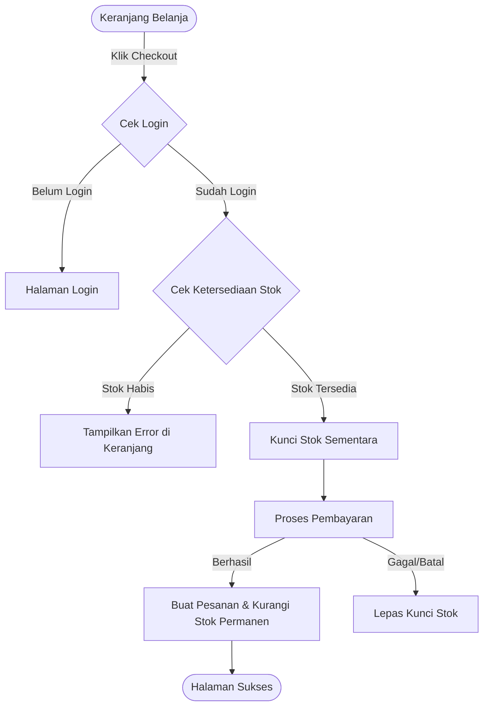
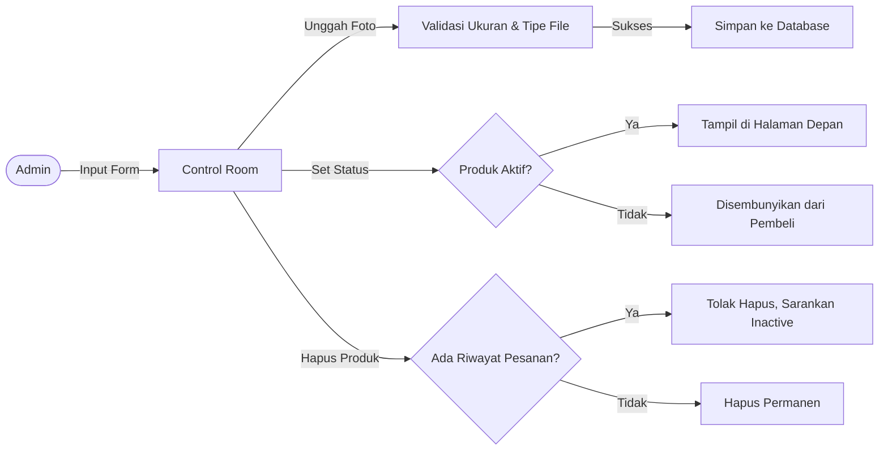
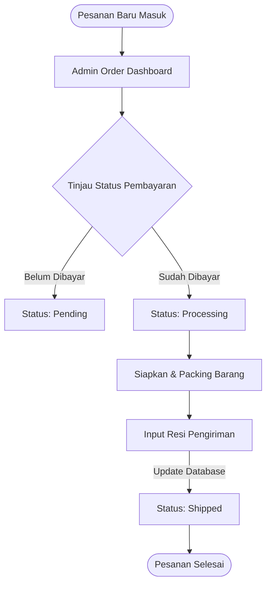
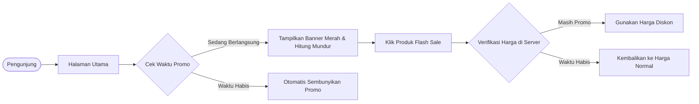
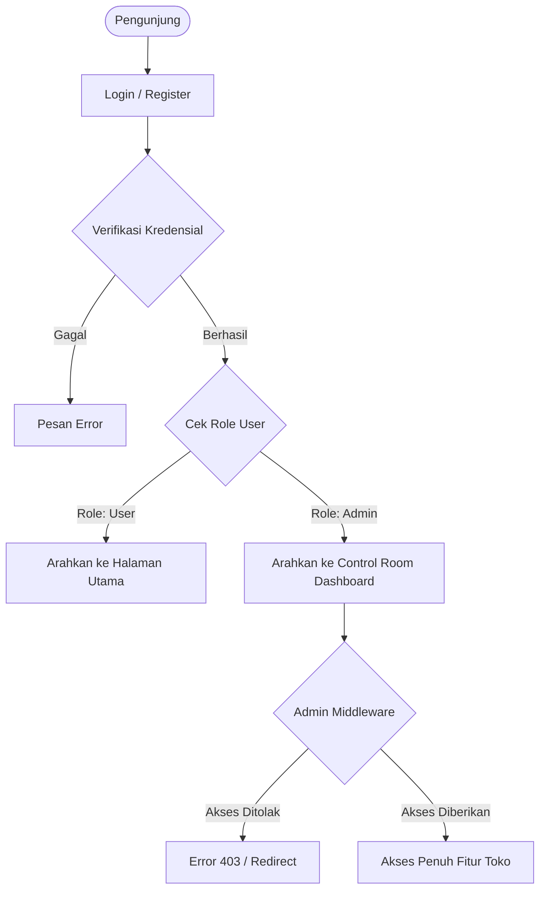
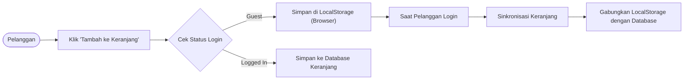
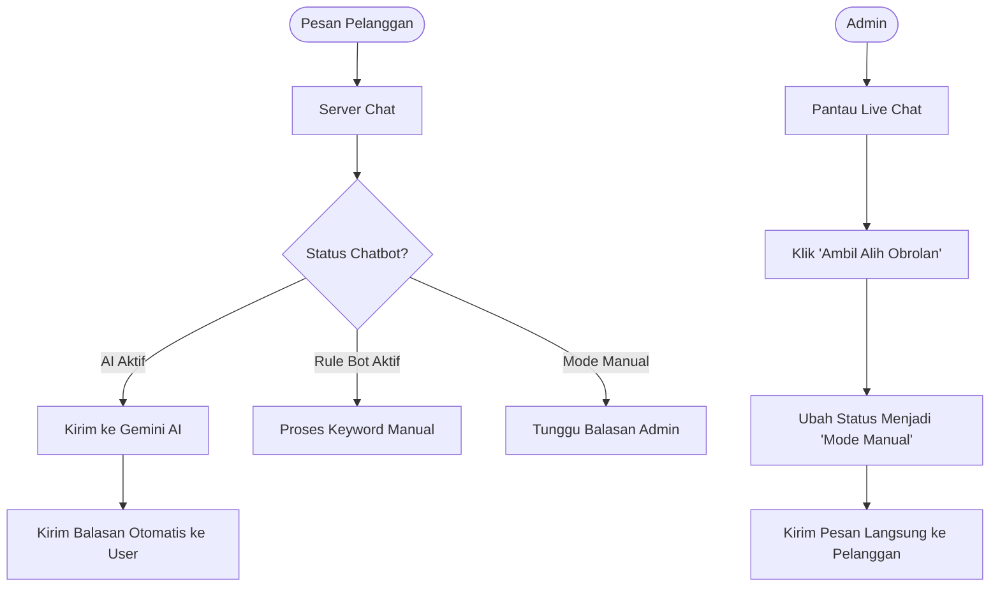
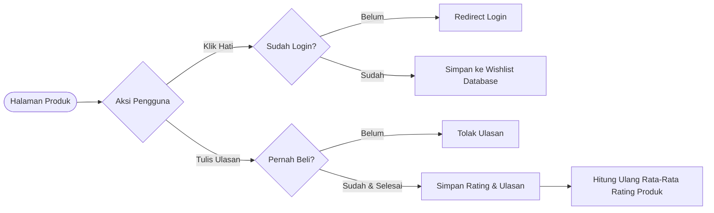

<div align="center">


# ⚡ HIGH FIVE ⚡
**Masa Depan Fashion Commerce Ada di Sini.**

[](https://laravel.com)
[](https://alpinejs.dev)
[](https://tailwindcss.com)
[](https://ai.google.dev/)

*Bukan sekadar pakaian. Ini tentang gaya hidup.*

</div>

---

> **HIGH FIVE** mendefinisikan ulang pengalaman belanja *online*. Kami membangun platform *e-commerce* bergaya modern yang terintegrasi secara mulus dengan asisten AI masa depan. Belanja *streetwear* bukan lagi sekadar transaksi; ini adalah sebuah pengalaman interaktif.

## 🔥 The Vibe (Fitur Utama)

### 🧠 Gemini-Powered Sales Assistant
Lupakan *chatbot* kaku yang membosankan. AI kami bertindak layaknya *fashion stylist* pribadimu langsung di dalam *website*.
- **Rekomendasi Visual Pintar:** Tanya apa yang sedang tren, dan bot ini tidak hanya menjawab dengan teks—tapi langsung menampilkan **Kartu Produk** interaktif di dalam *chat*.
- **Paham Konteks:** AI ini hafal luar dalam soal inventaris, harga, dan rilis terbaru kita. Tanya soal warna atau ukuran, dan dia akan mengecek *database* secara *real-time*.
- **Unified Cross-Device Session:** Logika pintar kami menggabungkan obrolan pelanggan (meski berpindah dari HP ke Laptop) ke dalam satu riwayat utuh jika mereka sudah *login*.

### 🛍️ The Storefront (Etalase Belanja)
- **Katalog Eksklusif:** Halaman belanja yang sangat cepat, dinamis, dan memanjakan mata, dibangun dengan estetika Tailwind CSS.
- **Pengalaman Cart yang Mulus:** Mulai dari memilih varian (warna/ukuran) hingga *checkout*, setiap interaksi terasa sangat lancar (berkat Alpine.js).
- **Hype Drops:** Sistem hitung mundur (*countdown*) bawaan untuk peluncuran koleksi eksklusif atau *Flash Sale*.

### 🕶️ Control Room (Dashboard Admin)
- **Live Takeover:** Pantau obrolan pelanggan secara *real-time*. Kalau AI butuh bantuan, admin manusia bisa langsung mengambil alih obrolan kapan saja.
- **Satu Tombol Sakti:** Ganti mode operasional *website* sesuka hati—dari Gemini AI yang super cerdas, kembali ke *Rule-Based Bot* biasa, atau masuk ke mode Manual sepenuhnya. Semuanya cuma butuh satu klik dan langsung tersimpan di *Cache*.

---

## 🏗️ Under the Hood (Di Balik Layar)

Sistem kami dibangun di atas arsitektur *backend* yang solid dan terstruktur rapi.

### Arsitektur AI Chatbot Pipeline


### Alur Checkout & Validasi Stok


### Sistem Manajemen Inventaris (Admin)


### Alur Pemrosesan Pesanan (Order Fulfillment)


### Logika "Hype Drops" & Flash Sale


### Sistem Autentikasi & Hak Akses (Role-Based Access)


### Sinkronisasi Keranjang Belanja (Smart Cart)


### Customer Service Routing (Live Takeover)


### Sistem Loyalitas: Ulasan & Wishlist


### Struktur Database Utama
| Tabel Model | Fungsi & Peran |
| :--- | :--- |
| `User` | Mengatur otentikasi profil pelanggan dan hak akses privilese Admin. |
| `Product` | Katalog utama. Menyimpan nama koleksi, harga, deskripsi, thumbnail, dan *status hype/flash sale*. |
| `ProductVariant` | Detail spesifik produk. Mengatur ketersediaan warna, ukuran, dan melacak manajemen stok (*inventory*). |
| `Message` | Menyimpan seluruh riwayat *Live Chat*. Menggunakan arsitektur `reply_to_id` untuk menghubungkan *thread* percakapan. |
| `Order` & `OrderItem` | Rekam jejak transaksi pengguna, alamat pengiriman, dan rincian keranjang belanja yang telah di-*checkout*. |

### 🎮 Arsitektur Controller (Dokumentasi Pengembang)

<details>
<summary><strong>1. ChatController (Front-Facing API)</strong></summary>

Lokasi: `app/Http/Controllers/ChatController.php`
- **Tugas Utama:** Mengelola penerimaan pesan pelanggan dari *Frontend* (Alpine.js).
- **Integrasi AI:** Menarik data produk `is_active` dan jumlah *sold items* dari database, mem- *parsing* nya menjadi teks, lalu merangkainya ke dalam **Prompt Engineering** rahasia yang dikirim ke Google Gemini. 
- **Response Parsing:** Menerjemahkan respons JSON AI menjadi data yang bisa dirender menjadi *Product Card* (Kartu Produk) di UI klien.
</details>

<details>
<summary><strong>2. Admin\ChatController (Control Room)</strong></summary>

Lokasi: `app/Http/Controllers/Admin/ChatController.php`
- **Manajemen Sesi:** Secara cerdas melakukan *Group By Session* untuk menampilkan daftar pelanggan yang sedang *online*. Menarik nama pengguna (*User Name*) secara akurat meski pesan terakhir dikirimkan oleh sistem AI.
- **Toggle Cache Engine:** Memodifikasi status `ai_active` dan `bot_active` secara *global* menggunakan Redis/File Cache tanpa perlu melakukan perpindahan halaman (*reload*).
</details>

<details>
<summary><strong>3. CheckoutController & ProductController</strong></summary>

- Mengelola validasi keranjang belanja, memastikan ketersediaan stok fisik `ProductVariant` sebelum memproses pesanan, serta mengembalikan data *catalog* secara dinamis ke halaman *storefront*.
</details>

---

## 🛡️ Keamanan & Validasi (Security)

Kami tidak mengorbankan keamanan demi estetika. Platform ini dilengkapi dengan pengamanan setingkat standar industri:

1. **Anti-Prompt Injection (AI Security):**
   Model Gemini dibatasi oleh *Prompt Engineering* yang sangat ketat (instruksi berlapis). AI diwajibkan untuk **membisu (mengembalikan string kosong)** jika pelanggan mencoba membahas hal di luar pakaian, komplain di luar nalar, atau mencoba memanipulasi bot.
2. **CSRF Protection:**
   Setiap pertukaran data (termasuk *fetch request* dari *Live Chat*) diproteksi penuh dengan token `@csrf` bawaan Laravel untuk mencegah serangan *Cross-Site Request Forgery*.
3. **Data Sanitization & XSS Prevention:**
   Semua input pengguna (seperti pesan obrolan) dibatasi panjang karakternya (maksimal 1000 karakter via `$request->validate()`) dan di-*escape* secara otomatis oleh *Blade engine* untuk mencegah serangan skrip silang (*Cross-Site Scripting*).
4. **Role-Based Authorization:**
   Seluruh area *Control Room* / *Dashboard* dilindungi oleh *middleware* khusus sehingga hanya akun dengan hak akses `admin` yang bisa mengubah pengaturan AI atau membaca pesan masuk pelanggan.

---

## 🚀 Cara Menjalankan (Instalasi Lokal)

Ingin me-*running* sistem keren ini di komputermu? Ikuti langkah berikut:

**1. Clone Source Code**
```bash
git clone https://github.com/username/highfive.git
cd highfive/laravel
```

**2. Install Dependencies**
```bash
composer install
npm install && npm run build
```

**3. Konfigurasi Environment**
```bash
cp .env.example .env
php artisan key:generate
```
*Buka file `.env` dan atur koneksi `DB_` kamu. Sangat Penting: Masukkan **API Key Google Gemini** kamu di variabel `GEMINI_API_KEY=`.*

**4. Bangun Database**
```bash
php artisan migrate --seed
php artisan storage:link
```

**5. Launching**
```bash
php artisan serve
```
*Buka `http://localhost:8000` di browsermu dan nikmati pengalamannya.*

---

<div align="center">
  <p><strong>Stay hype. Stay stylish. Stay secure.</strong></p>
  <p>Dibuat dengan semangat penuh oleh <strong>Tim HIGH FIVE</strong>.</p>
</div>
